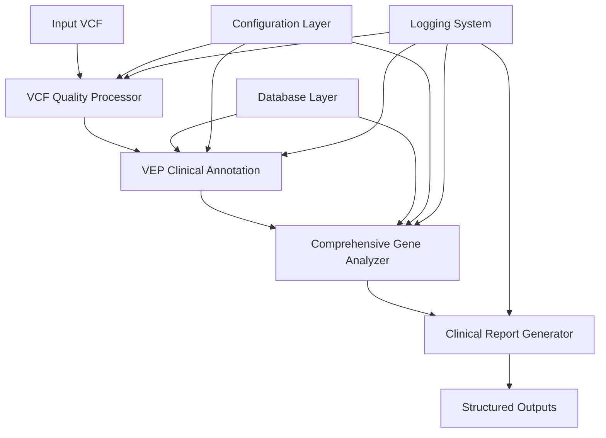

# Clinical Genomics Pipeline - Technical Reference v4.1

**Comprehensive Technical Documentation for System Architecture, Components, and Configuration**

This technical reference provides detailed information about the Clinical Genomics Pipeline architecture, implementation details, database specifications, and configuration options for system administrators and bioinformaticians.

---

## 📋 Table of Contents

1. [System Architecture](#system-architecture)
2. [Component Details](#component-details)
3. [Database Specifications](#database-specifications)
4. [Configuration Management](#configuration-management)
5. [API and Integration](#api-and-integration)
6. [Performance Specifications](#performance-specifications)
7. [Security and Compliance](#security-and-compliance)
8. [Development and Customization](#development-and-customization)

---

## 🏗️ System Architecture

### **Pipeline Architecture Overview**



### **Core Components Architecture**

```
/mnt/d/Genome/
├── PIPELINES/VCF_PIPELINE/                    # Main pipeline orchestration
│   ├── clinical_genomics_pipeline.sh         # Master orchestrator
│   ├── vcf_quality_processor.py             # DRAGEN-aware preprocessing
│   └── VCF_pipeline_config.yaml             # Pipeline configuration
│
├── COMPONENTS/                               # Modular components
│   ├── CLASSIFICATION/                       # Variant classification
│   │   ├── comprehensive_gene_analyzer.py   # Enhanced multi-transcript parser
│   │   ├── gene_panels_database.py          # Gene definitions (626+ genes)
│   │   └── analysis_wrapper.py              # Compatibility wrapper
│   ├── ANNOTATION/                          # Variant annotation
│   │   └── vep_clinical_annotation.sh       # VEP v114+ wrapper
│   └── REPORTING/                           # Report generation
│       └── clinical_report_generator.py     # HTML/CSV/JSON outputs
│
├── databases/                               # Genomic databases (600GB+)
│   ├── reference/                          # Reference genome
│   ├── vep_cache/                          # VEP cache v114
│   ├── gnomad/                             # Population frequencies
│   ├── clinvar/                            # Clinical significance
│   ├── cadd/                               # Pathogenicity scores
│   └── dbnsfp/                             # Prediction algorithms
│
└── DATA/                                   # Processing and results
    ├── INPUTS/raw_vcfs/                    # Input VCF files
    ├── PROCESSED/vcf_processed/            # Preprocessed VCFs
    ├── RESULTS/VCF_ANALYSIS/               # Organized results
    └── LOGS/                               # Comprehensive logging
```

### **Technology Stack**

**Core Technologies:**
- **Shell Scripting:** Bash for pipeline orchestration
- **Python 3.8+:** Core analysis components
- **VEP v114+:** Variant Effect Predictor (Ensembl)
- **bcftools/htslib:** VCF manipulation and processing
- **cyvcf2:** High-performance VCF parsing

**Dependencies:**
```yaml
Programming Languages:
  - Bash 4.0+
  - Python 3.8+

Core Tools:
  - VEP 114+ (Ensembl Variant Effect Predictor)
  - bcftools 1.15+
  - bgzip/tabix (htslib)
  - samtools 1.15+

Python Libraries:
  - pandas >= 1.3.0
  - numpy >= 1.21.0
  - cyvcf2 >= 0.30.0
  - pyyaml >= 5.4.0
  - pathlib
  - logging
  - argparse
```

---

## 🔧 Component Details

### **1. Main Orchestrator** (`clinical_genomics_pipeline.sh`)

**Purpose:** Master control script that coordinates all pipeline components
**Location:** `PIPELINES/VCF_PIPELINE/clinical_genomics_pipeline.sh`

**Key Features:**
- Comprehensive system validation and dependency checking
- Professional logging with timestamped progress tracking
- Error handling with automatic rollback capabilities
- Resource monitoring and optimization
- Multi-mode support (single, trio, batch)

**Technical Implementation:**
```bash
# Core execution flow
1. System validation (check_pipeline_system)
2. Dependency verification (check_dependencies) 
3. Script validation (check_pipeline_scripts)
4. Sample directory creation (create_sample_directories)
5. Processing execution (process_single_sample)
6. Quality validation and reporting
```

**Configuration Parameters:**
```bash
# Default settings (overridable)
BASE_DIR="/mnt/d/Genome"
DEFAULT_THREADS=8
DEFAULT_BUFFER_SIZE=50000
PIPELINE_VERSION="v4.1"
```

### **2. VCF Quality Processor** (`vcf_quality_processor.py`)

**Purpose:** DRAGEN-aware VCF preprocessing with comprehensive quality control
**Location:** `PIPELINES/VCF_PIPELINE/vcf_quality_processor.py`

**DRAGEN-Specific Fixes:**
```python
# Header typo corrections
DRAGEN_HEADER_FIXES = {
    'ReatPosRankSum': 'ReadPosRankSum',  # Common DRAGEN typo
}

# FORMAT field cleanup
INVALID_CHARACTERS = ['$', '#', '@', '%', '^', '&', '*']

# Chromosome normalization
CHROMOSOME_MAPPING = {
    'chr1': '1', 'chr2': '2', ..., 'chrX': 'X', 'chrY': 'Y', 'chrM': 'MT'
}
```

**Quality Control Thresholds:**
```python
QC_THRESHOLDS = {
    'min_quality_score': 20,
    'min_genotype_quality': 20,
    'min_depth': 10,
    'max_depth': 1000,
    'min_allele_balance': 0.2,
    'max_allele_balance': 0.8,
    'ti_tv_ratio_min': 1.8,
    'ti_tv_ratio_max': 2.5,
    'contamination_threshold': 0.02
}
```

**Processing Pipeline:**
1. **DRAGEN Issue Detection and Fixing**
2. **Header Enhancement and Standardization**
3. **Variant Normalization** (with reference genome)
4. **Multiallelic Variant Splitting**
5. **Duplicate Removal**
6. **Quality Filtering**
7. **Coordinate Sorting and Validation**
8. **Output Generation** (multiple formats)

### **3. VEP Clinical Annotation** (`vep_clinical_annotation.sh`)

**Purpose:** Comprehensive variant annotation using VEP v114+ with clinical databases
**Location:** `COMPONENTS/ANNOTATION/vep_clinical_annotation.sh`

**VEP Configuration:**
```bash
# Core VEP settings
VEP_VERSION="114+"
ASSEMBLY="GRCh38"
CACHE_VERSION="114"
BUFFER_SIZE="50000"
FORKS="8"

# Annotation features
--everything                    # Comprehensive annotations
--symbol --hgvs --hgvsg        # Gene symbols and HGVS nomenclature  
--canonical --mane_select       # Transcript selection
--biotype --domains --numbers   # Additional annotations
--af --af_gnomade --af_gnomadg  # Population frequencies
--sift b --polyphen b          # Basic predictions
```

**Plugin Integration:**
```bash
# AlphaMissense (Structure-based pathogenicity)
--plugin AlphaMissense,file=/mnt/d/Genome/databases/alphamissense/AlphaMissense_hg38.tsv.gz

# CADD (Combined annotation dependent depletion)
--plugin CADD,/mnt/d/Genome/databases/cadd/whole_genome_SNVs_v1.7.tsv.gz

# dbNSFP (Multiple prediction algorithms)
--plugin dbNSFP,/mnt/d/Genome/databases/dbnsfp/dbNSFP5.1a_variant.chr*.gz,\
SIFT_score,SIFT_pred,Polyphen2_HDIV_score,REVEL_score,AlphaMissense_score

# SpliceAI (Splice site prediction)
--plugin SpliceAI,cutoff=0.2,distance=500,mask=1

# ClinVar (Clinical significance)
--custom /mnt/d/Genome/databases/clinvar/clinvar_20250901.vcf.gz,ClinVar,vcf,exact,0,\
CLNSIG,CLNREVSTAT,CLNDN,CLNDISDB
```

### **4. Comprehensive Gene Analyzer** (`comprehensive_gene_analyzer.py`)

**Purpose:** Enhanced multi-transcript VEP CSQ parser with clinical gene analysis
**Location:** `COMPONENTS/CLASSIFICATION/comprehensive_gene_analyzer.py`

**Enhanced Multi-Transcript Parsing:**
```python
class VEPCSQParser:
    def __init__(self, vcf_path):
        self.csq_fields = []
        self.field_indices = {}
        self._parse_csq_header()
    
    def _extract_best_score_from_multivalue(self, raw_value, score_type='default'):
        """
        Extract best score from VEP multi-transcript format: '0.145&.&.&.&.&.'
        20x improvement in score extraction
        """
        values = raw_value.split('&')
        valid_scores = []
        
        for value in values:
            if value and value != '.' and value != '':
                try:
                    score = float(value)
                    # Validate score range by type
                    if self._validate_score_range(score, score_type):
                        valid_scores.append(score)
                except (ValueError, TypeError):
                    continue
        
        # Return strategy based on score type
        if score_type == 'gnomad':
            return min(valid_scores) if valid_scores else 1.0  # Conservative
        else:
            return max(valid_scores) if valid_scores else 0.0  # Most pathogenic
```

**Gene Database Integration:**
```python
class ComprehensiveGeneDatabase:
    def __init__(self):
        self.genes = {}  # 626+ genes
        self.evidence_hierarchy = {
            'TIER_1_CLINICAL': 100,      # ACMG SF v3.3
            'TIER_2_EXPERT': 90,         # ClinGen Expert Panels
            'TIER_3_CLINICAL_LAB': 80,   # Clinical lab panels
            'TIER_4_ESTABLISHED': 70,    # OMIM established
            'TIER_5_EMERGING': 60,       # ClinVar pathogenic
            'TIER_6_RESEARCH': 50,       # Specialty databases
            'TIER_7_MINIMAL': 30         # Research literature
        }
        self.actionability_scores = {
            'IMMEDIATELY_ACTIONABLE': 50,
            'SCREENING_ACTIONABLE': 40,
            'FAMILY_ACTIONABLE': 30,
            'COUNSELING_INDICATED': 20,
            'RESEARCH_INTEREST': 10
        }
```

**Clinical Significance Scoring:**
```python
def _calculate_variant_score(self, variant, gene, csq_value):
    """Calculate variant clinical significance score (0-100 scale)"""
    score = 0
    
    # ClinVar significance (highest weight: 40 points)
    clinvar = self._extract_clinvar_from_csq(csq_value)
    if 'pathogenic' in clinvar.lower():
        score += 40
    
    # Consequence severity (up to 25 points)
    consequence = self._extract_consequence_from_csq(csq_value)
    if consequence in ['stop_gained', 'frameshift_variant']:
        score += 25
    elif 'missense' in consequence:
        score += 15
    
    # Population frequency (up to 20 points)
    gnomad_af = self._extract_gnomad_af_from_csq(csq_value)
    if gnomad_af < 0.00001:
        score += 20
    
    # Pathogenicity predictions (up to 35 points total)
    revel = self._extract_revel_from_csq(csq_value)
    if revel >= 0.75: score += 15
    
    alphamissense = self._extract_alphamissense_from_csq(csq_value)
    if alphamissense >= 0.564: score += 10
    
    cadd = self._extract_cadd_from_csq(csq_value)
    if cadd >= 30: score += 10
    
    return max(score, 0)
```

### **5. Gene Panels Database** (`gene_panels_database.py`)

**Purpose:** Comprehensive gene definitions organized by medical specialty
**Location:** `COMPONENTS/CLASSIFICATION/gene_panels_database.py`

**Gene Panel Structure:**
```python
COMPREHENSIVE_GENE_PANELS = {
    'CARDIAC': {
        # ACMG SF v3.3 cardiac genes (31 genes)
        'ACTC1', 'MYBPC3', 'MYH7', 'TNNI3', 'TNNT2', 'TPM1',
        'KCNH2', 'KCNQ1', 'SCN5A', 'RYR2', 'TTN', 'LMNA',
        # Additional clinical cardiac genes
        'GATA4', 'GATA6', 'TBX5', 'NKX2-5', 'CACNA1C'
    },
    'CDLS': {
        'NIPBL', 'SMC1A', 'SMC3', 'RAD21', 'HDAC8', 'BRD4', 'ANKRD11'
    },
    'ONCOLOGY': {
        # Hereditary cancer genes (40+ genes)
        'BRCA1', 'BRCA2', 'TP53', 'APC', 'MLH1', 'MSH2', 'MSH6',
        'PMS2', 'VHL', 'NF1', 'NF2', 'PTEN', 'STK11', 'CDKN2A'
    }
    # ... 19 additional specialties
}

# Total coverage: 626+ unique genes across 22 specialties
ALL_COMPREHENSIVE_GENES = set()
for panel_genes in COMPREHENSIVE_GENE_PANELS.values():
    ALL_COMPREHENSIVE_GENES.update(panel_genes)
```

---

## 💾 Database Specifications

### **Database Architecture**

```
databases/ (600GB+ total)
├── reference/                                          # 761MB
│   └── Homo_sapiens.GRCh38.dna.primary_assembly.fa.gz
├── vep_cache/v114_GRCh38/                             # 20GB
│   ├── homo_sapiens/114_GRCh38/
│   └── plugins/
├── gnomad/v4.1/                                       # 184GB
│   ├── gnomad.exomes.v4.1.sites.chr1.vcf.bgz
│   └── ... (24 chromosome files)
├── clinvar/                                           # 162MB
│   ├── clinvar_20250901.vcf.gz
│   └── clinvar_20250901.vcf.gz.tbi
├── cadd/v1.6-1.7/                                     # 82GB + 1.2GB
│   ├── whole_genome_SNVs_v1.7.tsv.gz
│   └── gnomad.genomes.InDels_v1.7.tsv.gz
└── dbnsfp/v4.9a/                                      # 73GB
    ├── dbNSFP4.9a_variant.chr1.gz
    └── ... (chromosome-specific files)
```

### **Database Update Requirements**

**Monthly Updates:**
```bash
# ClinVar (First Tuesday of each month)
CLINVAR_URL="https://ftp.ncbi.nlm.nih.gov/pub/clinvar/vcf_GRCh38/"
CURRENT_DATE=$(date +%Y%m01)
wget "${CLINVAR_URL}/clinvar_${CURRENT_DATE}.vcf.gz"
```

**Quarterly Updates:**
```bash
# VEP Cache updates
vep_install -a cf -s homo_sapiens -y GRCh38 -c /mnt/d/Genome/databases/vep_cache --CACHE_VERSION 114
```

**Stable Databases (annual updates):**
- **gnomAD:** Major releases every 1-2 years
- **CADD:** Major releases every 2-3 years  
- **dbNSFP:** Updates 2-3 times per year

### **Database Performance Optimization**

**Storage Requirements:**
```yaml
Database Performance:
  SSD Storage: Recommended (10x faster than HDD)
  Network Storage: Acceptable if >1GB/s bandwidth
  Local Storage: Optimal for frequent access
  
Indexing Requirements:
  VCF files: bgzip + tabix indexing mandatory
  FASTA files: samtools faidx indexing required
  Custom databases: Pre-sorted for binary search
```

**Memory Mapping:**
```python
# Optimized database access patterns
DATABASE_ACCESS = {
    'gnomad': 'random_access',      # Requires indexing
    'clinvar': 'sequential_scan',    # Small enough for full scan
    'cadd': 'random_access',        # Large, requires efficient lookup
    'vep_cache': 'memory_mapped',   # Frequently accessed
}
```

---

## ⚙️ Configuration Management

### **Primary Configuration File** (`VCF_pipeline_config.yaml`)

**System Configuration:**
```yaml
system:
  platform: "WSL Ubuntu 22.04 on Windows"
  base_directory: "/mnt/d/Genome"
  assembly: "GRCh38"
  pipeline_version: "4.1"
  conda_environment: "vep_v114"

directories:
  base: "/mnt/d/Genome"
  input_data: "/mnt/d/Genome/DATA/INPUTS/raw_vcfs"
  processed_vcfs: "/mnt/d/Genome/DATA/PROCESSED/vcf_processed"
  results: "/mnt/d/Genome/DATA/RESULTS/VCF_ANALYSIS"
  logs: "/mnt/d/Genome/DATA/LOGS"
```

**VEP Configuration:**
```yaml
vep:
  version: "114.2"
  plugins_dir: "/mnt/d/Genome/vep_setup/plugins"
  performance:
    default_forks: 8
    default_buffer_size: 50000
    memory_recommendation: "64-128GB"
  plugins:
    dbnsfp:
      enabled: true
      optional: true  # Continue if fails
    spliceai:
      enabled: true
      real_time: true
      cutoff: 0.2
    cadd:
      enabled: true
      optional: true
```

**Analysis Parameters:**
```yaml
analysis:
  frequency_thresholds:
    dominant_pathogenic: 0.001      # 0.1%
    recessive_carrier: 0.01         # 1%
    x_linked_hemizygous: 0.001      # 0.1%
    acmg_ba1_benign: 0.05          # 5%
    acmg_bs1_benign: 0.01          # 1%
    
  consequences:
    high_impact:
      - "stop_gained"
      - "frameshift_variant"
      - "splice_donor_variant"
      - "splice_acceptor_variant"
```

### **Environment Configuration**

**Conda Environment:**
```yaml
# environment.yml
name: clinical_genomics_v41
channels:
  - bioconda
  - conda-forge
dependencies:
  - python=3.9
  - pandas>=1.3.0
  - numpy>=1.21.0
  - cyvcf2>=0.30.0
  - pyyaml>=5.4.0
  - bcftools>=1.15
  - htslib>=1.15
  - samtools>=1.15
  - ensembl-vep>=114
```

**System PATH Configuration:**
```bash
# Required PATH additions
export PATH="/mnt/d/Genome/vep_setup/ensembl-vep:$PATH"
export PATH="/mnt/d/Genome/databases/vep_cache:$PATH"
export PERL5LIB="/mnt/d/Genome/vep_setup/ensembl-vep:$PERL5LIB"
```

---

## 🔌 API and Integration

### **Command Line Interface**

**Primary Interface:**
```bash
# Single sample processing
bash clinical_genomics_pipeline.sh single <input.vcf.gz> <sample_id> [threads]

# Trio analysis
bash clinical_genomics_pipeline.sh trio <mother.vcf.gz> <father.vcf.gz> <child.vcf.gz> <family_id> [threads]

# Batch processing
bash clinical_genomics_pipeline.sh batch <input_directory> [threads]
```

**Python Component APIs:**
```python
# VCF Quality Processor API
from vcf_quality_processor import MaximumQualityVCFProcessor
processor = MaximumQualityVCFProcessor(logger, qc_logger, reference_genome)
result = processor.process_vcf(input_vcf, output_vcf, sample_id, temp_dir)

# Gene Analyzer API
from comprehensive_gene_analyzer import ComprehensiveVariantAnalyzer
analyzer = ComprehensiveVariantAnalyzer(gene_database)
success = analyzer.analyze_annotated_vcf(vcf_path, sample_id)
```

### **Integration Points**

**External System Integration:**
```python
# Clinical Laboratory Information Systems (LIS)
def export_for_lis(sample_results, format='HL7'):
    """Export results in clinical LIS format"""
    pass

# Electronic Health Records (EHR)
def generate_clinical_summary(variant_results, patient_phenotype):
    """Generate EHR-compatible clinical summary"""
    pass

# Genetic Counseling Systems
def create_counseling_report(high_priority_variants, family_history):
    """Create genetic counseling report"""
    pass
```

**Output Format APIs:**
```python
OUTPUT_FORMATS = {
    'CSV': 'clinical_analysis/SAMPLE_ID_ENHANCED_VARIANTS.csv',
    'HTML': 'clinical_analysis/SAMPLE_ID_ENHANCED_ANALYSIS.html',
    'JSON': 'clinical_analysis/SAMPLE_ID_analysis_summary.json',
    'VCF': 'vep_annotation/SAMPLE_ID_comprehensive.vcf.gz'
}
```

---

## ⚡ Performance Specifications

### **Resource Requirements**

**Minimum System Requirements:**
```yaml
Hardware:
  CPU: 4+ cores (Intel/AMD x64)
  RAM: 32GB minimum, 64GB recommended
  Storage: 1.1TB available space
  Network: 100Mbps for database downloads

Software:
  OS: Ubuntu 22.04+ / CentOS 8+ / WSL2
  Python: 3.8+
  Perl: 5.26+ (for VEP)
  Conda: Miniconda3 or Anaconda3
```

**Optimal System Configuration:**
```yaml
Hardware:
  CPU: 16+ cores, 2.5GHz+ base frequency
  RAM: 128GB+ for optimal performance
  Storage: NVMe SSD with 2TB+ capacity
  Network: 1Gbps+ for rapid database access

Performance Benefits:
  CPU: Linear scaling up to 16 cores
  RAM: Reduced disk I/O, faster processing
  SSD: 10x faster database access
  Network: Faster initial setup and updates
```

### **Performance Benchmarks**

**Processing Times (Validated):**
```yaml
Whole Genome (4.7M variants):
  Total Time: 2-3 hours
  VCF Preprocessing: 5-10 minutes
  VEP Annotation: 150-180 minutes
  Clinical Analysis: 30-60 minutes
  Report Generation: 5 minutes

Whole Exome (50K variants):
  Total Time: 20-40 minutes
  VCF Preprocessing: 1-2 minutes
  VEP Annotation: 15-25 minutes
  Clinical Analysis: 3-8 minutes
  Report Generation: 1-2 minutes

Targeted Panel (1K variants):
  Total Time: 5-15 minutes
  VCF Preprocessing: <1 minute
  VEP Annotation: 2-8 minutes
  Clinical Analysis: 1-3 minutes
  Report Generation: <1 minute
```

**Resource Utilization:**
```yaml
Memory Usage:
  Peak RAM: 8-16GB per sample
  VEP Process: 4-8GB
  Python Analysis: 2-4GB
  System Overhead: 2-4GB

CPU Utilization:
  VEP Annotation: 80-95% (multi-threaded)
  Python Analysis: 60-80% (single-threaded)
  I/O Operations: 20-40%

Disk Usage:
  Temporary Files: 5-20GB per sample
  Final Results: 1-5GB per sample
  Database Access: 50-200 IOPS
```

### **Scalability Characteristics**

**Horizontal Scaling:**
```python
# Multiple samples processing
CONCURRENT_SAMPLES = {
    'system_32gb': 1,  # Conservative
    'system_64gb': 2,  # Recommended
    'system_128gb': 4, # Optimal
    'system_256gb': 8  # High-throughput
}
```

**Performance Optimization:**
```bash
# High-performance configuration
VEP_FORKS=16              # CPU cores available
VEP_BUFFER_SIZE=100000    # Double default for more RAM
PARALLEL_SAMPLES=2        # Process 2 samples simultaneously
```

---

## 🔒 Security and Compliance

### **Data Security**

**File System Permissions:**
```bash
# Recommended permissions
chmod 750 /mnt/d/Genome/                    # Directory access
chmod 640 /mnt/d/Genome/databases/*        # Database files (read-only)
chmod 750 /mnt/d/Genome/PIPELINES/*        # Executable scripts
chmod 660 /mnt/d/Genome/DATA/RESULTS/*     # Result files
```

**Access Control:**
```yaml
User Roles:
  Administrator:
    - Full system access
    - Database management
    - Configuration changes
  
  Analyst:
    - Run pipeline
    - Access results
    - No configuration changes
  
  Viewer:
    - Read-only access to results
    - No pipeline execution
```

**Data Privacy:**
```python
# Data handling guidelines
PRIVACY_REQUIREMENTS = {
    'patient_identifiers': 'remove_or_hash',
    'genomic_data': 'encrypt_at_rest',
    'results': 'access_controlled',
    'logs': 'sanitized_identifiers'
}
```

### **Regulatory Compliance**

**CLIA Compliance Considerations:**
```yaml
Quality Assurance:
  - Documented procedures (SOPs)
  - Regular quality control testing
  - Proficiency testing participation
  - Personnel training records

Validation Requirements:
  - Analytical validation studies
  - Clinical validation correlation
  - Accuracy and precision assessment
  - Reference material testing
```

**CAP Compliance Considerations:**
```yaml
Technical Requirements:
  - Method validation documentation
  - Quality control procedures
  - Instrument maintenance records
  - Data integrity measures

Clinical Requirements:
  - Appropriate test utilization
  - Result interpretation guidelines
  - Turnaround time monitoring
  - Critical value policies
```

**Audit Trail Requirements:**
```python
AUDIT_LOGGING = {
    'user_actions': 'timestamp_user_command',
    'data_access': 'file_access_logs',
    'configuration_changes': 'version_controlled',
    'results_delivery': 'recipient_tracking'
}
```

---

## 🛠️ Development and Customization

### **Extending Gene Panels**

**Adding New Medical Specialties:**
```python
# gene_panels_database.py
COMPREHENSIVE_GENE_PANELS['NEW_SPECIALTY'] = {
    'GENE1', 'GENE2', 'GENE3', ...
}

# Update the comprehensive gene set
ALL_COMPREHENSIVE_GENES.update(COMPREHENSIVE_GENE_PANELS['NEW_SPECIALTY'])
```

**Custom Gene Scoring:**
```python
# comprehensive_gene_analyzer.py
def _add_custom_specialty_genes(self):
    """Add institution-specific gene panels"""
    custom_genes = {
        'CUSTOM_GENE1': {
            'evidence_tier': 'TIER_2_EXPERT',
            'actionability': 'IMMEDIATELY_ACTIONABLE',
            'condition': 'Custom condition',
            'specialty': 'CUSTOM_SPECIALTY'
        }
    }
    self.genes.update(custom_genes)
```

### **Custom Scoring Algorithms**

**Adding New Pathogenicity Predictors:**
```python
def _extract_custom_score_from_csq(self, csq_value):
    """Extract custom pathogenicity score"""
    if not self.csq_parser:
        return 0.0
    
    raw_value = self.csq_parser.get_field_value(
        csq_value.split(',')[0], 'CUSTOM_SCORE'
    )
    return self._extract_best_score_from_multivalue(raw_value, 'custom')
```

**Custom ACMG Evidence Rules:**
```python
def _apply_custom_acmg_rules(self, variant_data):
    """Apply institution-specific ACMG interpretation rules"""
    evidence_codes = []
    
    # Custom PM1 implementation
    if self._is_in_custom_functional_domain(variant_data):
        evidence_codes.append('PM1')
    
    # Custom PS3 implementation  
    if self._has_custom_functional_validation(variant_data):
        evidence_codes.append('PS3')
    
    return evidence_codes
```

### **Integration Development**

**LIS Integration Template:**
```python
class LISIntegration:
    def __init__(self, lis_config):
        self.lis_endpoint = lis_config['endpoint']
        self.credentials = lis_config['credentials']
    
    def export_results(self, sample_results, format='HL7'):
        """Export results to Laboratory Information System"""
        if format == 'HL7':
            return self._generate_hl7_message(sample_results)
        elif format == 'LOINC':
            return self._generate_loinc_results(sample_results)
    
    def _generate_hl7_message(self, results):
        """Generate HL7 formatted message"""
        # Implementation specific to LIS requirements
        pass
```

**Clinical Decision Support Integration:**
```python
class ClinicalDecisionSupport:
    def __init__(self, cds_config):
        self.phenotype_matcher = PhenotypeMatcher()
        self.guideline_engine = GuidelineEngine()
    
    def generate_recommendations(self, variant_results, patient_phenotype):
        """Generate clinical recommendations based on variants and phenotype"""
        recommendations = []
        
        for variant in variant_results:
            phenotype_match = self.phenotype_matcher.assess_match(
                variant['gene'], patient_phenotype
            )
            
            if phenotype_match > 0.8:
                recommendation = self.guideline_engine.get_recommendation(
                    variant, phenotype_match
                )
                recommendations.append(recommendation)
        
        return recommendations
```

### **Testing and Validation Framework**

**Unit Testing:**
```python
# tests/test_gene_analyzer.py
import unittest
from comprehensive_gene_analyzer import ComprehensiveVariantAnalyzer

class TestGeneAnalyzer(unittest.TestCase):
    def setUp(self):
        self.analyzer = ComprehensiveVariantAnalyzer(test_gene_db)
    
    def test_revel_score_extraction(self):
        """Test enhanced REVEL score extraction"""
        csq_value = "missense_variant|BRCA1|0.875&.&.&."
        score = self.analyzer._extract_revel_from_csq(csq_value)
        self.assertEqual(score, 0.875)
    
    def test_multi_transcript_parsing(self):
        """Test multi-transcript value parsing"""
        multi_value = "0.145&.&0.234&.&0.891&."
        best_score = self.analyzer._extract_best_score_from_multivalue(
            multi_value, 'revel'
        )
        self.assertEqual(best_score, 0.891)
```

**Integration Testing:**
```python
# tests/test_pipeline_integration.py
def test_full_pipeline_execution():
    """Test complete pipeline execution with known sample"""
    test_vcf = "tests/data/test_sample.vcf.gz"
    result = subprocess.run([
        "bash", "clinical_genomics_pipeline.sh", 
        "single", test_vcf, "TEST_SAMPLE", "4"
    ], capture_output=True)
    
    assert result.returncode == 0
    assert os.path.exists("DATA/RESULTS/VCF_ANALYSIS/individuals/TEST_SAMPLE/")
```

---

## 📈 Monitoring and Maintenance

### **System Monitoring**

**Performance Monitoring:**
```bash
# Monitor system resources during processing
#!/bin/bash
# monitor_pipeline.sh

while true; do
    echo "$(date): CPU: $(top -bn1 | grep "Cpu(s)" | awk '{print $2}' | cut -d'%' -f1)"
    echo "$(date): Memory: $(free -h | awk 'NR==2{printf "%.1f%%", $3*100/$2}')"
    echo "$(date): Disk: $(df -h /mnt/d/Genome | awk 'NR==2{print $5}')"
    sleep 60
done
```

**Quality Monitoring:**
```python
def monitor_quality_metrics(sample_results):
    """Monitor key quality indicators"""
    metrics = {
        'score_extraction_rate': calculate_score_extraction_rate(sample_results),
        'variant_count': len(sample_results),
        'high_priority_variants': count_high_priority(sample_results),
        'processing_time': get_processing_time(),
        'error_rate': calculate_error_rate()
    }
    
    # Alert if metrics outside expected ranges
    if metrics['score_extraction_rate'] < 0.8:
        alert("Low score extraction rate detected")
    
    return metrics
```

### **Maintenance Procedures**

**Database Maintenance:**
```bash
#!/bin/bash
# monthly_maintenance.sh

# Update ClinVar (monthly)
cd /mnt/d/Genome/databases/clinvar/
wget https://ftp.ncbi.nlm.nih.gov/pub/clinvar/vcf_GRCh38/clinvar_$(date +%Y%m01).vcf.gz

# Clean old log files (keep 3 months)
find /mnt/d/Genome/DATA/LOGS/ -name "*.log" -mtime +90 -delete

# Validate database integrity
bcftools view -h clinvar_current.vcf.gz | grep "##fileDate"
```

**Performance Optimization:**
```bash
# weekly_optimization.sh

# Clear temporary files
rm -rf /mnt/d/Genome/DATA/PROCESSED/vcf_processed/*_temp*

# Optimize disk usage
sudo fstrim -v /mnt/d/

# Update system indices
updatedb

# Check for database corruption
for db in /mnt/d/Genome/databases/*/; do
    if [[ -f "$db/*.vcf.gz" ]]; then
        bcftools index --check "$db/*.vcf.gz"
    fi
done
```

---

**Technical Reference Version:** 1.0  
**Pipeline Version:** v4.1  
**Last Updated:** September 2025  

*This technical reference provides comprehensive documentation for system administrators, bioinformaticians, and developers working with the Clinical Genomics Pipeline. For additional technical support, consult the component-specific documentation in each module directory.*